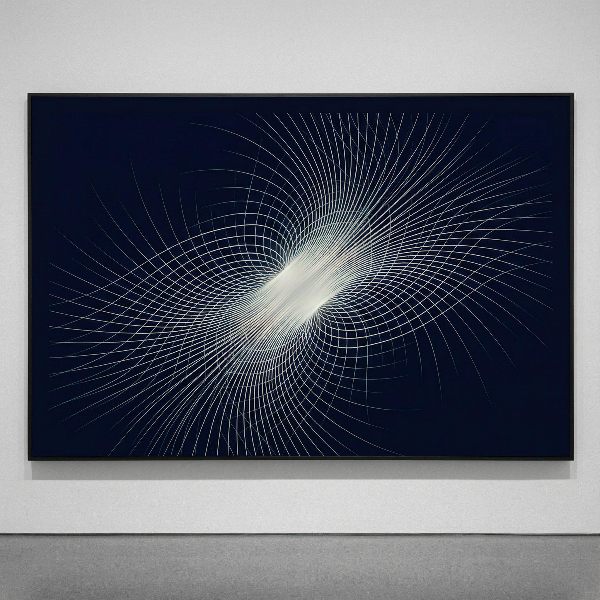

# SYNTRIAD Digit-Dynamics Discovery Engine

**Systematische computationele exploratie van vastepunt-structuur in dynamische systemen van cijferoperaties.**

[](https://opensource.org/licenses/MIT)

Een computationele engine voor het verkennen, classificeren en verifiëren van algebraïsche structuur in samengestelde cijferoperatiesystemen. Geëvolueerd door 15 versies en 11 menselijk gestuurde onderzoekssessies, waarbij multi-agent AI-samenwerking gecombineerd werd met algebraïsch redeneren om 9 theorema's te identificeren en computationeel te verifiëren over willekeurige getalbases (b ≥ 3).



---

## 🎯 Kernontdekking: De P_k Projectie

**Het Probleem:** Wanneer je cijferoperaties (reverse, digit-sum, sort) herhaaldelijk op getallen toepast, krimpen ze doorgaans tot enkelvoudige cijfers. Wiskundig oninteressant.

**Het Inzicht:** Voeg **vaste-lengte padding** toe (de P_k projectie) en er ontstaat rijke algebraïsche structuur:
- 9 theorema's met algebraïsche bewijzen, exhaustief geverifieerd
- 5 oneindige vasteputfamilies met expliciete telformules
- Universele patronen over **alle getalbases** (b ≥ 3)
- Resonantiestructuur bepaald door base-aritmetiek: (b−1)(b+1)² = 1089 in base 10

**Het diepere punt:** De vaste punten zijn geen toevalligheden — ze worden afgedwongen door de algebraïsche structuur van positionele getalsystemen. Specifiek bepalen 10 ≡ 1 (mod 9) en 10 ≡ −1 (mod 11) welke getallen herhaalde cijferoperaties overleven.

Lees meer: [Wat We Ontdekten](docs/NL/WAT_WE_ONTDEKTEN.md) | [Emergentie-essay](assets/emergence-mechanisms.md)

---

## 📚 Repository Structuur

Enkele Engelse codebase met tweetalige documentatie:

### **[→ Documentatie](docs/)**
- **[English docs](docs/EN/)** - Volledige documentatie in het Engels
- **[Nederlandse docs](docs/NL/)** - Volledige documentatie in het Nederlands

### **[→ Code & Onderzoek](src/)**
Alle code in het Engels voor internationale samenwerking.

### **[→ Assets](assets/)**
Visualisaties en essays over universele patronen.

---

## 🚀 Snel Starten

```bash
pip install -r requirements.txt

# Draai de onderzoeksengine (laatste: v10, wat v15 is in evolutie)
python engines/abductive_reasoning_engine_v10.py

# Draai de reproduceerbaarheidspipeline (M0-M4 modules)
python scripts/reproduce.py --db data/results.db --out repro_out --bundle

# Draai alle tests
pytest tests/ -v
```

Zie [ARCHITECTURE.md](ARCHITECTURE.md) voor technische details.

---

## 📄 Preprints & OEIS

### Preprints (ongepubliceerd)
- **Paper A:** "Fixed Points of Digit-Operation Pipelines in Arbitrary Bases"
  9 theorema's, 5 oneindige families, multi-base generalisatie

- **Paper B:** "Attractor Spectra and ε-Universality in Digit-Operation Dynamical Systems"
  Complementair aan Paper A — experimentele verificatie over 10⁷ inputs

### OEIS

| Entry | Beschrijving | Type | Status |
|-------|-------------|------|--------|
| **[A393794](https://oeis.org/A393794)** | Vaste punten van de 1089-truc-afbeelding | nieuwe reeks | ✅ Geaccepteerd 27 feb 2026 |
| **[A203648](https://oeis.org/A203648)** | Fox n-kleuringen van trefoilknoop (d=3) | annotatie | ✅ Geaccepteerd 18 mrt 2026 |
| **[A394222](https://oeis.org/A394222)** | Fox n-kleuringen, 2-brug-knopen det=5 | nieuwe reeks | ✅ Geaccepteerd 18 mrt 2026 |
| **[A394223](https://oeis.org/A394223)** | Fox n-kleuringen, 2-brug-knopen det=7 | nieuwe reeks | ✅ Geaccepteerd 18 mrt 2026 |

Alle vier entries zijn voortgekomen uit de AXIOM vaste-punten-census engine,
die direct is gegroeid uit de P_k projectie-ontdekking die hier gedocumenteerd is.
Zie ook: [cellular-automata/oeis/](cellular-automata/oeis/) en [knot-theory/oeis/](knot-theory/oeis/) voor de indieningsartefacten.

---

## 🧬 De Evolutie

De engine evolueerde door 15 versies over 11 feedbackrondes, gestuurd door een menselijke onderzoeker die drie AI-systemen orkestreerde:

| Fase | Versies | Wat Veranderde |
|------|---------|----------------|
| **Rekenen** | v1–v2 | GPU brute-force verificatie, exhaustieve attractordetectie |
| **Verkennen** | v4–v6 | Operatoralgebra, invariantontdekking, symbolische voorspelling |
| **Begrijpen** | v7–v9 | Kennisbank (83 feiten), causale ketens, zelf-bevraging |
| **Verifiëren** | v10–v15 | Formele bewijzen (12/12), multi-base generalisatie, open vragen |
| **Formaliseren** | M0–M4 | Canonieke hashing, deterministische reproduceerbaarheid, paper-appendices |

De progressie: *observeren → classificeren → voorspellen → bewijzen*.

Volledig verhaal: [Evolutie van Scripts naar Redeneren](docs/NL/EVOLUTIE_VAN_SCRIPTS_TOT_REDENEREN.md)

---

## 🎨 Visualisaties & Essays

### [Convergentiepatroon](assets/convergence-pattern.png)
Hoge-resolutie visualisatie van vastepuntclustering in de cijferoperatieruimte.

### [De Mechanica van Emergentie](assets/emergence-mechanisms.md)
Essay dat onderzoekt hoe eenvoudige regels complexe structuur creëren over vijf systemen — van moleculen tot cultuur. Toont cijferdynamica als instantie van universele emergentiepatronen.

---

## 🔬 Kernresultaten

### Wiskundige Resultaten (Paper A)

| Theorema | Stelling | Scope |
|----------|----------|-------|
| Symmetrische VP-telling | (b−2) · b^(k−1) symmetrische vaste punten onder 2k-cijferige getallen | Alle bases b ≥ 3 |
| Universele 1089-familie | A_b = (b−1)(b+1)² generaliseert 1089 naar elke base | Alle bases b ≥ 3 |
| Vijf oneindige families | Expliciete telformules, paarsgewijs disjunct | Base 10 |
| Vijfde familie (1089-truc) | n_k = 110 · (10^(k−3) − 1) voor k ≥ 5 | Base 10 |
| Kaprekar-constanten | K_b = (b/2)(b²−1) voor even bases; 495 en 6174 algebraïsch | Bases b ≥ 4 |
| Armstrong-bovengrens | k_max(b) ≤ ⌊b · log(b) / log(b − 1)⌋ + 1 | Alle bases b ≥ 3 |
| Conditionele Lyapunov | Digit-sum-daling voor operaties in klasse P ∪ C | Alle bases |

### Computationele Verificatie

- 260 unittests over M0–M4 modules (deterministische infrastructuur)
- 98 legacy tests over onderzoeksengines (v4–v15)
- 12/12 algebraïsche bewijzen computationeel geverifieerd
- Exhaustieve verificatie over alle k-cijferige inputs voor k = 3…7
- Canonieke SHA-256 hashketen: register → pipeline → domein → resultaat

---

## 🤖 Multi-Agent Onderzoeksproces

Dit project gebruikte een tripartite samenwerkingsmodel:

| Rol | Agent | Bijdrage |
|-----|-------|----------|
| **Menselijke Visionair** | R. Havenaar | Onderzoeksrichting, conceptuele sprongen, orkestratie, algebraïsch inzicht |
| **Wiskundige Consultant** | DeepSeek (R1–R5) | Diep wiskundig redeneren, verfijning van vermoedens |
| **Implementatie & Schaling** | Manus (R6) | Bulk-implementatie, multi-base engine, protocoluitvoering |
| **Formele Bewijzen & Architectuur** | Claude/Cascade (R7–R11) | Bewijsverificatie, M0–M4 architectuur, publicatievoorbereiding |

De menselijke onderzoeker stuurde elke onderzoeksfase, identificeerde de algebraïsche structuren, en maakte de conceptuele sprongen die cijferoperaties verbonden met modulaire aritmetiek. De AI-systemen voerden uit, verifieerden en formaliseerden.

---

## 🏗️ Architectuur

De codebase heeft twee sporen:

### Onderzoeksengine (v15)
Enkel-bestand exploratie-engine (~6.500 regels). Bevat 30 modules verspreid over 6 redeneerlagen — van empirische dynamica tot abductief redeneren. Gebruikt voor ontdekking en vermoedengeneratie.

### Reproduceerbaarheidsinfrastructuur (M0–M4.1)
Modulaire, deterministische, publicatiekwaliteit codebase:

| Module | Functie | Regels |
|--------|---------|--------|
| **M0** (pipeline_dsl.py) | Canonieke semantiek, operatieregister, SHA-256 identiteit | ~1.050 |
| **M1** (experiment_runner.py) | SQLite resultaatopslag, batchuitvoering, JSON-export | ~640 |
| **M2** (feature_extractor.py) | Getalkenmerken, orbitanalyse, vermoedenmining | ~900 |
| **M3** (proof_engine.py) | Bewijsskeletten, dichtheidsschatting, rangschikkingsmodel v1.0 | ~1.160 |
| **M4** (appendix_emitter.py) | LaTeX-appendixgeneratie, manifest, reproduceerbaarheidsbundel | ~1.170 |

Kernbeslissing in het ontwerp: **Laag A (semantisch) / Laag B (executie) scheiding** in M0. Pipelinespecificaties zijn zuivere data — inspecteerbaar, hashbaar en onafhankelijk van implementatie.

---

## 🧪 Methodologische Noot

Dit onderzoek gebruikte Productie-Validatie (P↔V) modularisatie als organisatorische heuristiek. De v1→v15 evolutie vertoont 6 meetbare P→V cycli (zie [PV Methodologie](docs/NL/PV_METHODOLOGIE.md)).

**Belangrijke disclaimers:**

Dit vormt GEEN bewijs dat P↔V:
- Wiskundig noodzakelijk is voor cijferoperatie-onderzoek
- Universeel is over alle ontdekkingsdomeinen
- Superieur is aan alle alternatieve methodologieën

Wat het WEL aantoont:
- P↔V was **instrumenteel nuttig** in dit geval
- Systematische kennisaccumulatie (83 feiten)
- Herbruikbare bewijsmodules (M0-M4)
- Meetbare meta-oscillatie (6 cycli)

**Efficiëntienoot:** De geschatte ~4x versnelling t.o.v. willekeurige brute-force is NIET empirisch gevalideerd. Zie [Beperkingen](docs/NL/BEPERKINGEN.md) voor volledige epistemische grenzen.

**Positionering:** Dit is een sterke casestudie van P↔V-nut in één domein, geen bewijs van universaliteit.

---

## 📖 Citeren

Als je dit werk gebruikt, citeer dan:

```bibtex
@misc{syntriad2026digit,
  title={Algebraic Structure of Fixed Points in Composed Digit-Operation Dynamical Systems},
  author={Havenaar, Remco and SYNTRIAD Research},
  year={2026},
  note={Computationele exploratie van cijferoperatiepipelines over willekeurige bases},
  url={https://github.com/SYNTRIAD/digit-dynamics}
}
```

---

## 📜 Licentie

MIT-licentie — zie [LICENSE](LICENSE) voor details.

---

## 🔗 Links

- **Papers:** [papers/](papers/)
- **Documentatie:** [docs/EN/](docs/EN/) | [docs/NL/](docs/NL/)
- **Broncode:** [src/](src/) (M0–M4 modules)
- **Onderzoeksengines:** [engines/](engines/) (v1–v15)
- **Reproduceerbaarheid:** [scripts/reproduce.py](scripts/reproduce.py)

---

*SYNTRIAD Research — februari 2026 · Bijgewerkt 18 maart 2026 (4 OEIS-entries geaccepteerd)*
